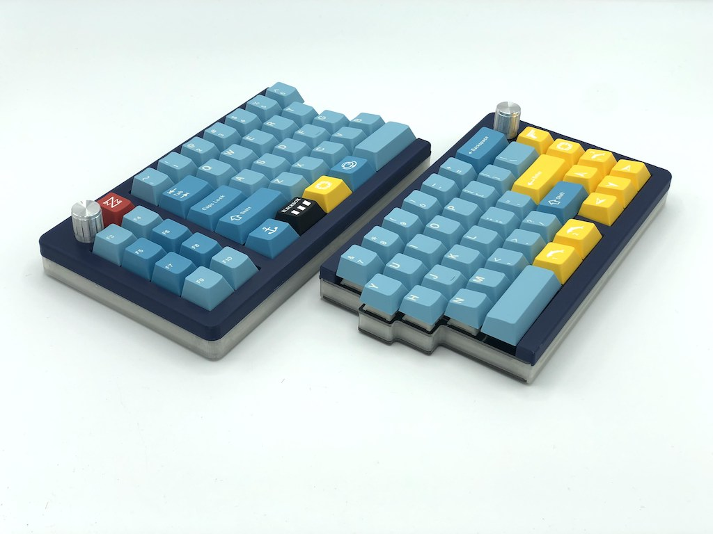

Quefrency Keyboard Case
=======================

Here's case design file for the [Quefrency](https://keeb.io/products/quefrency-60-split-staggered-keyboard). You can turn on/off various layers to generate the different plates needed.

The main files that the everything else has been derived from are the .ai (Adobe Illustrator) files. The .ai files have multiple layers to toggle on/off to generate the correct set of plates/mid-layers/etc. All of the DXF files have been derived from the .ai files.

## Rev. 1 vs. Rev. 2

The difference between Rev 1 and Rev 2 plates are the following:

- Rev 2 does not have Alps support, while Rev 1 does
- Rev 2 adds ISO support and a few more bottom row layout options
- Rev 2 has a different arrangement of screw/standoff holes to allow for an acrylic mid layer to be used

## Rev. 2

All of the DXF files are in metric (millimeters).

### Switch Plates
The plate files in the [main rev2 directory](rev2/) are designed for 1.5mm thick plates. If doing acrylic plates, then either a thickness of 3mm or 5mm should be used. Files for these thicker plates can be found in the [3mm Plates](rev2/3mm Plates) and [5mm Plates](rev2/5mm Plates) directories. The difference with these thicker plates is that the stabilizer cutouts are larger to accomdate the stabilzer housing and wire.

### 3D printed middle layers
The current STLs are temporary ones, and better ones that fit around the TRRS jack and USB-C port will be worked on and released later.

## Rev. 3

The only difference between Rev. 2 and 3 is that Rev. 3 replaced the TRRS port with a USB-C port. The Rev. 2 files should still work fine with the Rev. 3 PCB.

Inside of the [enclosed-case-rev3-rev4 directory](enclosed-case-rev3-rev4/) are files to print an enclosing shell around the board. They will need to be used in conjuction with the FR4 plates from the store.

The top shells for Rev. 3 can be used for Rev. 2, but currently, there's no matching middle layer files to match the shells.

## Rev. 4

For the Rev. 4 hotswap PCB, you can use the files in [enclosed-case-rev3-rev4 directory](enclosed-case-rev3-rev4/). Plates are the same as [Rev. 2](rev2/). If you want the blockered version of the right half switch plate, see the [Rev. 4](rev4/) directory.

License
-------
These case files are released under the MIT License.
